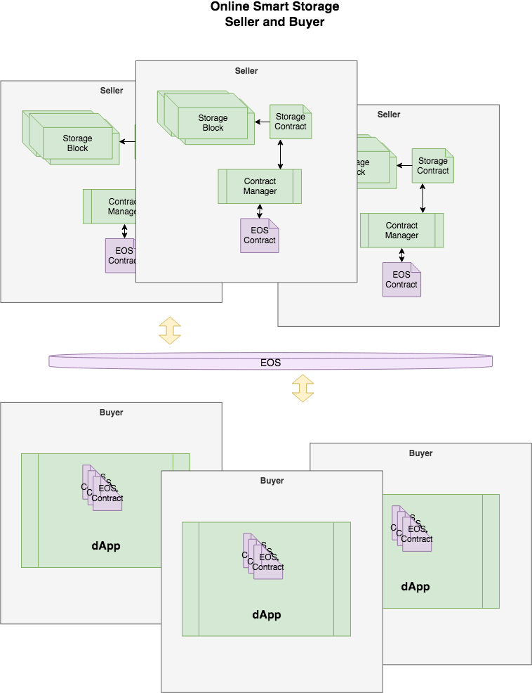

# Online-Smart-Storage 
## Smart-Contract for storage
----------------------
### Why

- Using smart-contracts to sell and buy online storage space

### Use

- Build then open browser to http://localhost:8080

```
  git clone https://github.com/alex-public/online-smart-storage.git
  cd online-smart-storage && quick_start.sh
  cd online-smart-storage/frontend && npm install && npm start
  cd online-smart-storage/backend && npm install && npm start
```

### Design



### Refs
- Frame work using [React-starter-kit](https://github.com/kriasoft/react-starter-kit) for UI/UX
- Smart-Contract using [Aphrodite](https://github.com/airbnb/hypernova) for Virtual Machine

### Authors
- [Alex Davis](https://www.alex2006hw.com/)
- Swain Hwang
- Brandt Leeds
